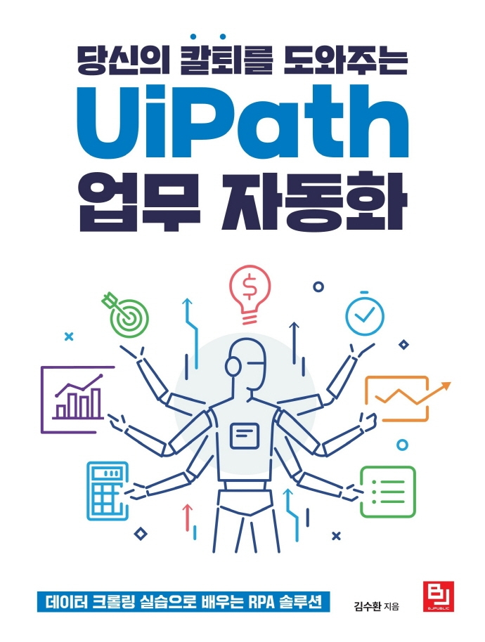

당신의 칼퇴를 도와주는 UiPath 업무 자동화  
==================
 

 

부제 : 데이터 크롤링 실습으로 배우는 RPA 솔루션
------------------   
 

* 저자 : 김수환  
* 출판사 : 비제이퍼블릭  
* 출간일 : 2021년 07월 30일
  
 
 안녕하세요 마개입니다. 

작년부터 진행했던 집필이 끝이 나고 
드디어 UiPath 책 "당신의 칼퇴를 도와주는 UiPath 업무 자동화"가 출간이 되었습니다. 📒👏  
그동안 유튜브를 통해 다루었던 기능들과 유튜브에서는 다루지 못했던 내용들을 포함하여 
UiPath 입문부터 응용까지 여러 내용들을 담아냈습니다.  
(UiPath Studio에 대한 내용으로 StudioX는 없습니다.)

집필 당시의 최신버전인 UiPath 2021.4 버전을 토대로 하였으니 
관심있으신 분들은 아래 링크를 참고해주세요 
  
 
 

**[온라인 서점]**
* 예스24 : https://bit.ly/3xdPHvS
* 교보문고 : https://bit.ly/3lAYbez
* 알라딘 : https://bit.ly/3C6LnCj
* 인터파크 : https://bit.ly/3A4Nch4
* 영풍문고 : https://bit.ly/3BZSPPw

 

**[마개튜브 유튜브]**
* https://bit.ly/2TWyDgo